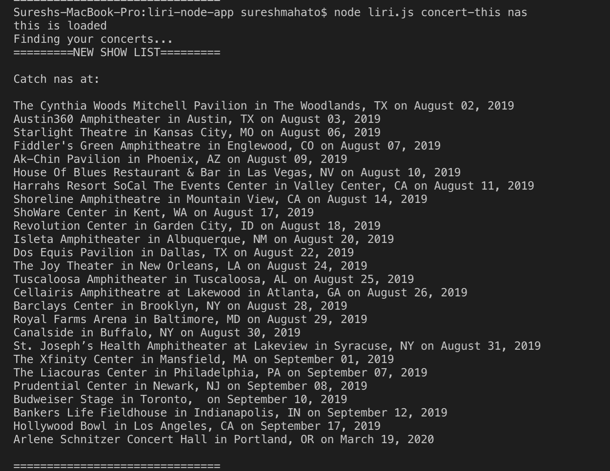
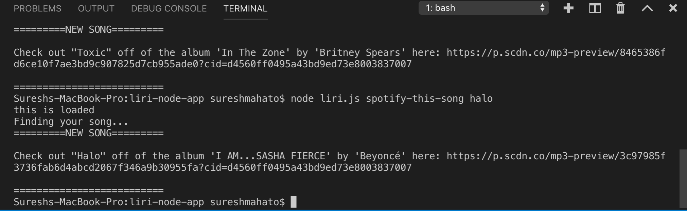
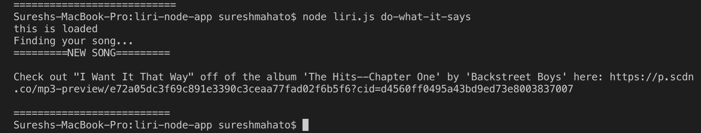

# liri-node-app
Homework-10
 
https://github.com/suresh7127/liri-node-app.git
 
Liri Bot:
With the help of this application, users can search for concerts, songs or movies on the command line. This node application utilizes Bands In Town, Spotify and OMDB API calls and modules to make request from CLI.
 
Here are the detail infornations on what each command will do:
 
1. node liri.js concert-this <artist/band name here> 
This CLI will discplay all the upcoming events for the artist/band  to the console.

 
2. node liri.js spotify-this-song '<song name here>' 
This CLI will discplay song information with album/artist name, song title and preview link URL to the console. 

 
3. node liri.js movie-this '<movie name here>' 
This CLI will display information about movie title, ratting, plot, cast, year released and langualge information to the terminl window. 

 
4. node liri.js do-what-it-says 

This CLI command will read the text in the random.txt file and return the information to the console.

 
The project was possible with the help of several dependencies including:

Axios -  to make HTTP requests  
Moment - to format times (MM/DD/YYYY)  
.env - to hide API keys  
Node-Spotify-API - for song information  
OMDB API -  for movie information  
Bands In Town API - for show information.  

As a developer, I take help of these dependencies and node.js application to make this project possible.
 
Please check the screenshot of these command in the images folder to better understand how these app works. 
I also updated my portfolio on github.